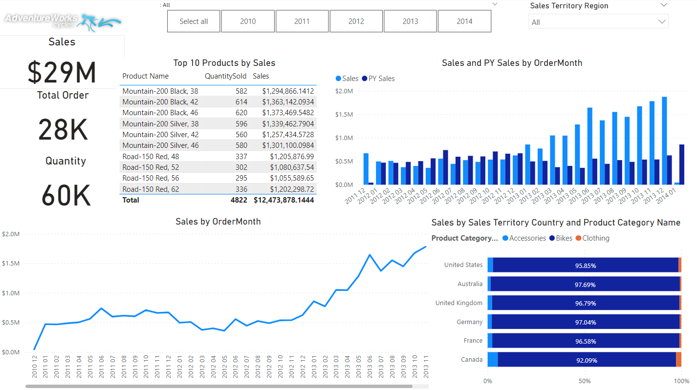

# Power BI Data Analysis
## [End to End Data Analysis project using Power BI](https://www.youtube.com/watch?v=48yE1d2vOcY)

## Project Setup
You will need the following Tech Stack to following along with this project. 

- SQL Server. You can setup SQL Server's environment using the [following guidelines](https://www.youtube.com/watch?v=e5mvoKuV3xs&t=6s)
- [Power BI Desktop](https://powerbi.microsoft.com/en-us/downloads/)

## Dimensional Modeling 101
To understand Kimball’s approach to data modeling, we should begin by talking about the star schema. The star schema is a particular way of organizing data for analytical purposes. It consists of two types of tables:
- A fact table, which acts as the primary table for the schema. A fact table contains the primary measurements, metrics, or ‘facts’ of a business process.
- Many dimension tables associated with the fact table. Each dimension table contains ‘dimensions’ — that is, descriptive attributes of the fact table.

## Develop Power BI Data Model
We develop a Star Schema using Dimensional Modeling in Power BI. We denormalize snlowflaked dimensions using M lnaguage in Power Query. Define relationship between Fact and dimension table. Clean and organize columns for the report layer. Our Data Model resembles a Star, just like the example below. Utilizing this Data Model we create reports and dashboards.

   

## Data Analysis via Dashboard

   
